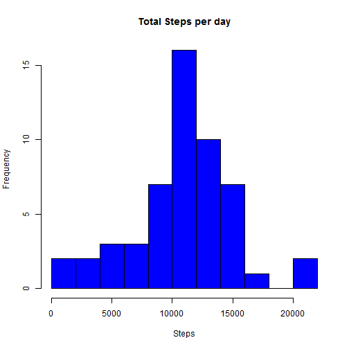
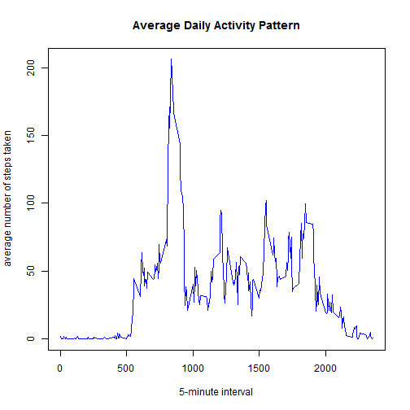
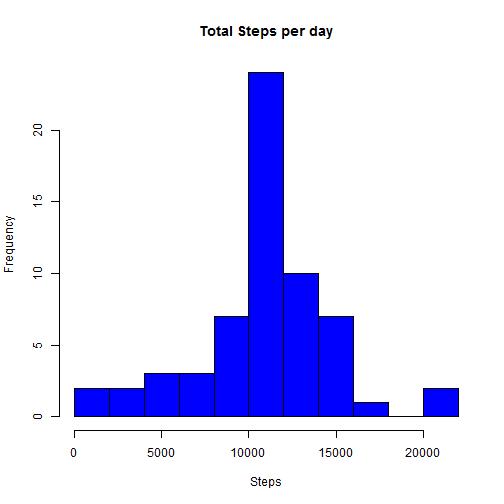
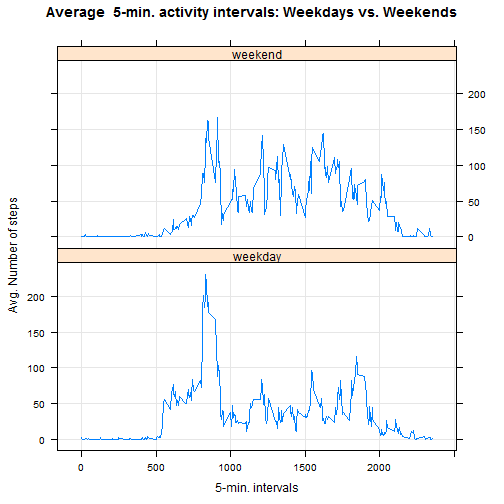

## Introduction

This assignment makes use of data from a personal activity monitoring device. This device collects data at 5 minute intervals through out the day. The data consists of two months of data from an anonymous individual collected during the months of October and November, 2012 and include the number of steps taken in 5 minute intervals each day.

The variables included in this dataset are:

- steps: Number of steps taking in a 5-minute interval (missing values are coded as NA)
- date: The date on which the measurement was taken in YYYY-MM-DD format
- interval: Identifier for the 5-minute interval in which measurement was taken

**Loading and preprocessing the data**


```r
## Reading basedata
data <- read.csv("activity.csv")

## Aggregating Total Steps by date
datadate <- ddply(data,.(date),summarize,Total.Steps=sum(steps))

## Aggregating Average Steps by Interval
datainterval <- ddply(data,.(interval),summarize,Avg.Steps=mean(steps,na.rm = TRUE))
```

**What is mean total number of steps taken per day?**

*Histogram of the total number of steps taken each day*


```r
hist(datadate$Total.Steps, breaks = 10,main = "Total Steps per day", xlab = "Steps",col="blue")
```



*Mean and median number of steps taken each day*


```r
mean(datadate$Total.Steps,na.rm = TRUE)
```

```
## [1] 10766.19
```

```r
median(datadate$Total.Steps,na.rm = TRUE)
```

```
## [1] 10765
```

**What is the average daily activity pattern?**

*Time series plot of the 5-minute interval and the average number of steps taken, averaged across all days*


```r
plot(Avg.Steps~interval,data=datainterval,type="l",xlab = "5-minute interval", ylab = "average number of steps taken", main = "Average Daily Activity Pattern", col = "blue")
```



*The 5-minute interval that, on average, contains the maximum number of steps*


```r
datainterval[which.max(datainterval$Avg.Steps),1]
```

```
## [1] 835
```

**Imputing missing values**

*Note that there are a number of days/intervals where there are missing values (coded as NA). The presence of missing days may introduce bias into some calculations or summaries of the data.*

- total number of missing values in the dataset (i.e. the total number of rows with NAs)


```r
sum(is.na(data$steps))
```

```
## [1] 2304
```

*Strategy for filling in all of the missing values in the dataset : the mean for that 5-minute interval*

- Creation of new dataset that is equal to the original dataset but with the missing data filled in


```r
dataimput <- data
for (i in 1:nrow(dataimput)){
        if(is.na(dataimput[i,1])==TRUE){
                dataimput[i,1]=datainterval[which(datainterval$interval==dataimput[i,3]),2]
        }
}
sum(is.na(dataimput$steps))
```

```
## [1] 0
```

```r
## Aggregating Total Steps by date
datadate2 <- ddply(dataimput,.(date),summarize,Total.Steps=sum(steps))
```

*Histogram of the total number of steps taken each day and Calculate and report the mean and median total number of steps taken per day.*


```r
hist(datadate2$Total.Steps,breaks = 10,main = "Total Steps per day", xlab = "Steps",col="blue")
```



```r
mean(datadate2$Total.Steps,na.rm = TRUE)
```

```
## [1] 10766.19
```

```r
median(datadate2$Total.Steps,na.rm = TRUE)
```

```
## [1] 10766.19
```

*Mean & Median comparision from the estimates from the first part of the assignment*

- The mean value is same as missing values are for 8 complete days and were replaced by respective 5-mins interval averages i.e. by a typical avg. day (without missing value)
- The median value differs as multiple (8 to be specific) Avg. values are introduced as a part of imputing process.


**Are there differences in activity patterns between weekdays and weekends?**

*Created a new factor variable in the dataset with two levels - "weekday" and "weekend" indicating whether a given date is a weekday or weekend day.*


```r
dataimputnew <- dataimput
dataimputnew$date <- as.Date(dataimputnew$date)
dataimputnew <- mutate(dataimputnew,day=ifelse(weekdays(date) %in% c("Sunday","Saturday"),"weekend","weekday"))
```

*Panel plot containing a time series plot of the 5-minute interval (x-axis) and the average number of steps taken, averaged across all weekday days or weekend days (y-axis).*


```r
## Aggregating Average Steps by Interval & Weekday/Weekend

dataimputnewinterval <- ddply(dataimputnew,.(interval,day),summarize,Avg.Steps=mean(steps,na.rm = TRUE))

xyplot(Avg.Steps ~ interval | day, data=dataimputnewinterval, type="l", layout=c(1,2), grid=TRUE,ylab="Avg. Number of steps", xlab="5-min. intervals", main="Average  5-min. activity intervals: Weekdays vs. Weekends")
```



*During Weekdays number of steps peaks towards morning time (8AM - 10 AM) and is relatively less post that. However during weekend, number of steps concentrated & spreads uniformly between 8AM to 8 PM*
